<p align="center">
  
</p>

<h1 align="center">ChitChat</h1>

<p align="center">
  <strong>Ứng dụng nhắn tin thời gian thực – Kết nối mọi lúc, mọi nơi</strong>
</p>

<p align="center">
  
  
  
  
  
  
  
</p>

<p align="center">
  
  
  
  
</p>

---

## 📖 Giới Thiệu

**ChitChat** là ứng dụng nhắn tin thời gian thực (real-time) fullstack, được xây dựng với kiến trúc **React + Express + MongoDB + Socket.IO**. Ứng dụng hỗ trợ chat 1-1, chat nhóm, gửi ảnh, emoji, ghim tin nhắn, chuyển tiếp tin nhắn, hệ thống kết bạn, đổi chủ đề chat, quản lý nhóm, và nhiều tính năng nâng cao khác.

### ✨ Điểm Nổi Bật

- **Real-time Messaging** – Tin nhắn được gửi & nhận tức thì qua Socket.IO
- **12+ Chat Themes** – Tuỳ chỉnh giao diện chat với nhiều chủ đề màu sắc & gradient
- **Dark / Light Mode** – Hỗ trợ chế độ tối / sáng toàn ứng dụng
- **Chat Nhóm** – Tạo nhóm, thêm / xoá thành viên, phân quyền admin
- **Ghim Tin Nhắn** – Ghim & cuộn đến tin nhắn quan trọng
- **Chuyển Tiếp Tin Nhắn** – Chuyển tiếp nhanh đến bạn bè hoặc nhóm
- **Reactions** – Thả cảm xúc (👍❤️😂😢😡) vào tin nhắn
- **Gửi Ảnh** – Upload ảnh qua Cloudinary
- **Biệt Danh** – Đặt nickname cho từng người trong cuộc trò chuyện
- **Hạn Chế Người Dùng** – Ẩn trạng thái online & trạng thái đã đọc
- **Lưu Trữ & Quản Lý Chat** – Lưu trữ, hạn chế, xoá lịch sử chat
- **Tìm Kiếm Tin Nhắn** – Tìm kiếm nhanh trong cuộc trò chuyện
- **Typing Indicator** – Hiển thị khi người khác đang nhập

---

## 🛠️ Tech Stack

### Frontend (`/fe`)

| Công nghệ | Mô tả |
|---|---|
| **React 19** + **TypeScript** | UI Library chính |
| **Vite 7** | Build tool siêu nhanh |
| **TailwindCSS 3** | Utility-first CSS framework |
| **Radix UI** | Headless UI components (Dialog, Dropdown, Tabs, Avatar, ...) |
| **Zustand 5** | State management nhẹ & mạnh mẽ |
| **Socket.IO Client** | Real-time communication |
| **React Hook Form** + **Zod** | Form validation |
| **React Router 7** | Client-side routing |
| **Sonner** | Toast notifications |
| **Lucide React** | Icon library |
| **Emoji Mart** | Emoji picker |
| **Infinite Scroll** | Lazy load tin nhắn cũ |

### Backend (`/be`)

| Công nghệ | Mô tả |
|---|---|
| **Express 5** | Web framework |
| **MongoDB** + **Mongoose 9** | Database & ODM |
| **Socket.IO** | WebSocket real-time |
| **JWT** | Authentication (Access Token + Refresh Token) |
| **Bcrypt** | Mã hoá mật khẩu |
| **Cloudinary** | Upload & quản lý ảnh |
| **Multer** | Middleware upload file |
| **Swagger UI** | API Documentation |
| **Cookie Parser** | Quản lý cookie cho refresh token |

---

## 🖼️ Giao Diện Ứng Dụng

### 1. Trang Đăng Ký (Sign Up)

Giao diện đăng ký tài khoản với background gradient hồng, form nhập thông tin gồm username, email, mật khẩu, tên hiển thị. Hỗ trợ validation real-time với Zod.

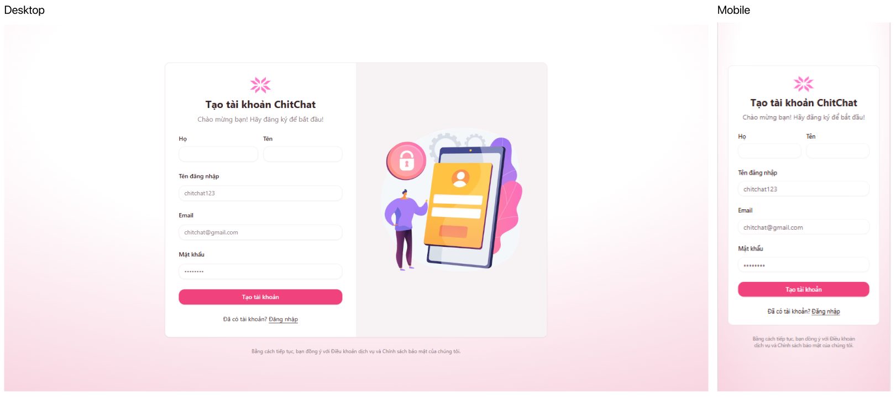

---

### 2. Trang Đăng Nhập (Sign In)

Giao diện đăng nhập với background gradient tím, form đăng nhập gọn gàng với username và mật khẩu. Xác thực JWT, tự động redirect sau khi đăng nhập thành công.

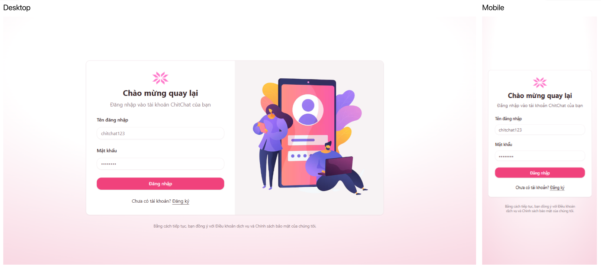

---

### 3. Giao Diện Chat Chính

Layout 2 phần: **Sidebar** bên trái hiển thị danh sách nhóm chat & bạn bè, **Chat Window** bên phải hiển thị cuộc trò chuyện đang chọn. Sidebar có nút toggle Dark/Light Mode, trạng thái online (chấm xanh), số tin nhắn chưa đọc, và nút tạo chat mới.

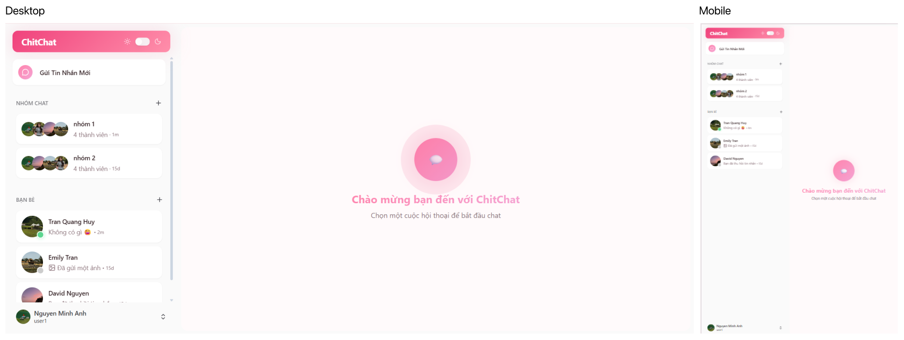

---

### 4. Chế Độ Tối (Dark Mode)

Toàn bộ ứng dụng hỗ trợ Dark Mode. Chuyển đổi nhanh bằng toggle switch trên header sidebar. Theme chat cũng tự động thích ứng theo chế độ tối.

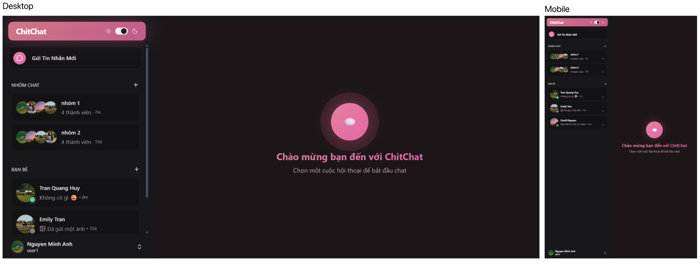

---

### 5. Cửa Sổ Nhắn Tin

Hiển thị tin nhắn theo thời gian, avatar người gửi, trạng thái "Đã xem" / "Đã gửi", typing indicator (3 chấm nhảy), nút cuộn xuống đáy, banner tin nhắn đã ghim ở trên cùng. Hỗ trợ gửi text, emoji, và ảnh.

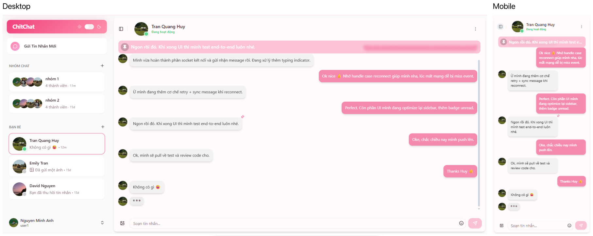

---

### 6. Reactions (Thả Cảm Xúc)

Hover vào tin nhắn để hiện menu reaction nhanh gồm 5 emoji: 👍 ❤️ 😂 😢 😡. Click vào reaction trên tin nhắn để xem chi tiết ai đã react, và có thể gỡ reaction của mình.

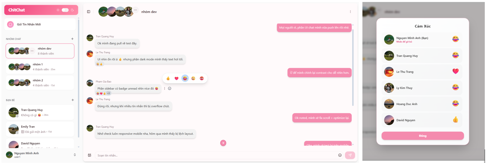

---

### 7. Thông Tin Cuộc Trò Chuyện - Thông tin bạn chat

Panel thông tin với avatar lớn, trạng thái online, các tuỳ chọn: Chủ đề, Biệt danh, Thông tin profile của bạn chat, Tin nhắn ghim, Tìm kiếm tin nhắn, Xem ảnh, Xoá lịch sử. Đối với chat nhóm có thêm: danh sách thành viên, thêm thành viên, phân quyền admin.

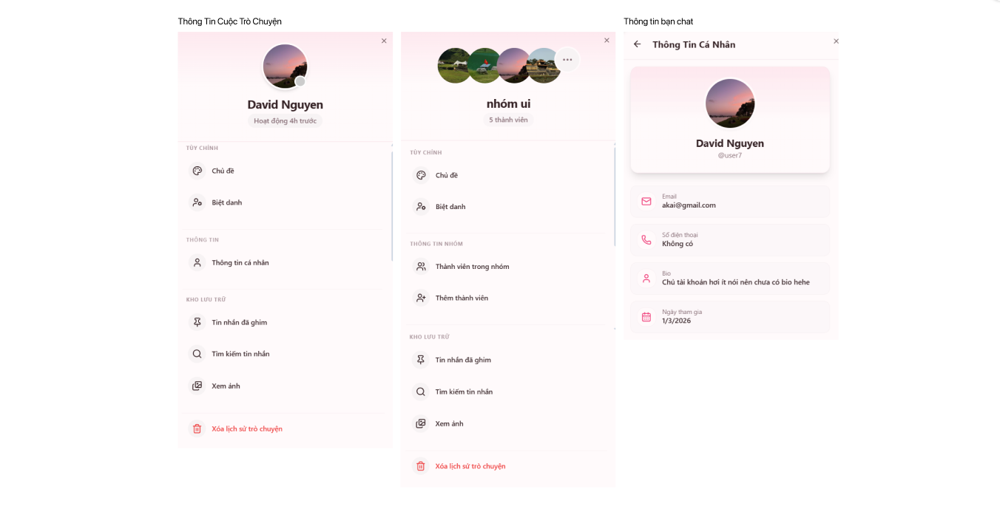

---

### 8. Ghim Tin Nhắn

Ghim tin nhắn quan trọng, hiển thị banner ghim ở đầu chat. Click banner để cuộn đến tin nhắn đã ghim (tự động load thêm tin nhắn cũ nếu cần). Quản lý danh sách tin nhắn ghim trong panel thông tin.

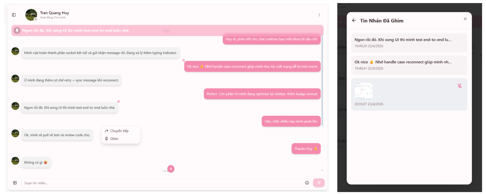

---

### 9. Chuyển Tiếp Tin Nhắn

Modal chuyển tiếp tin nhắn với 2 tab: **Bạn bè** và **Nhóm**. Hiển thị trạng thái online, nickname, nút gửi với loading animation, tick khi đã gửi thành công.

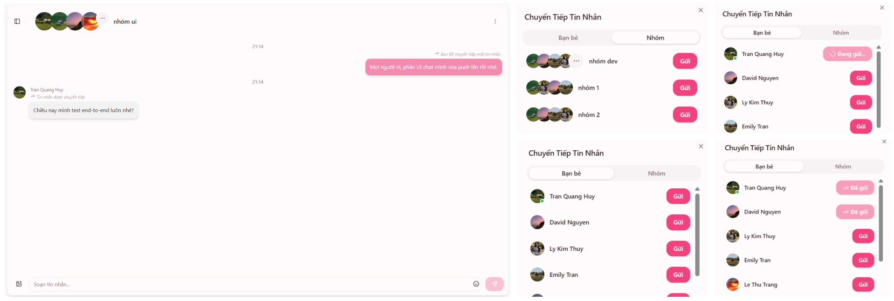

---

### 10. Thu Hồi Tin Nhắn

Thu hồi tin nhắn đã gửi – tin nhắn sẽ hiển thị dạng italic "Bạn đã thu hồi tin nhắn" / "Tin nhắn đã được thu hồi" với giao diện mờ.

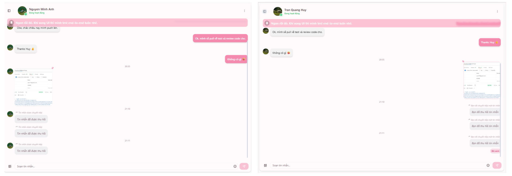

---

### 11. Chủ Đề Chat (12+ Themes)

Tuỳ chỉnh chủ đề màu cho từng cuộc trò chuyện. Bao gồm:

| Solid Colors | Gradient Themes |
|---|---|
| 🩷 Mặc định (Hồng) | 🌸 Kẹo Bông (Pink-Purple) |
| 💜 Tím | 🌌 Thiên Hà (Blue-Purple) |
| 💙 Xanh | 🌅 Hoàng Hôn (Orange-Yellow) |
| 💚 Xanh lá | 🌈 Cực Quang (Green-Cyan) |
| 🧡 Cam | ⬛ Tối Giản (B&W) |
| ❤️ Đỏ | |
| 🩵 Lam | |

Mỗi theme có bản preview trực tiếp, hỗ trợ đổi màu theo Light & Dark mode.

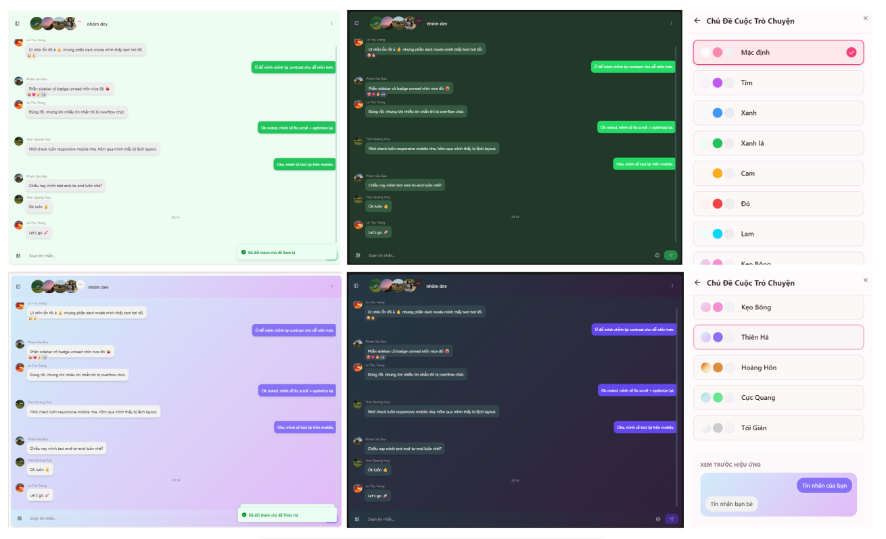

---

### 12. Biệt Danh (Nicknames)

Đặt biệt danh cho từng thành viên trong cuộc trò chuyện. Biệt danh hiển thị trên header chat, modal chuyển tiếp, và thông tin cuộc trò chuyện.

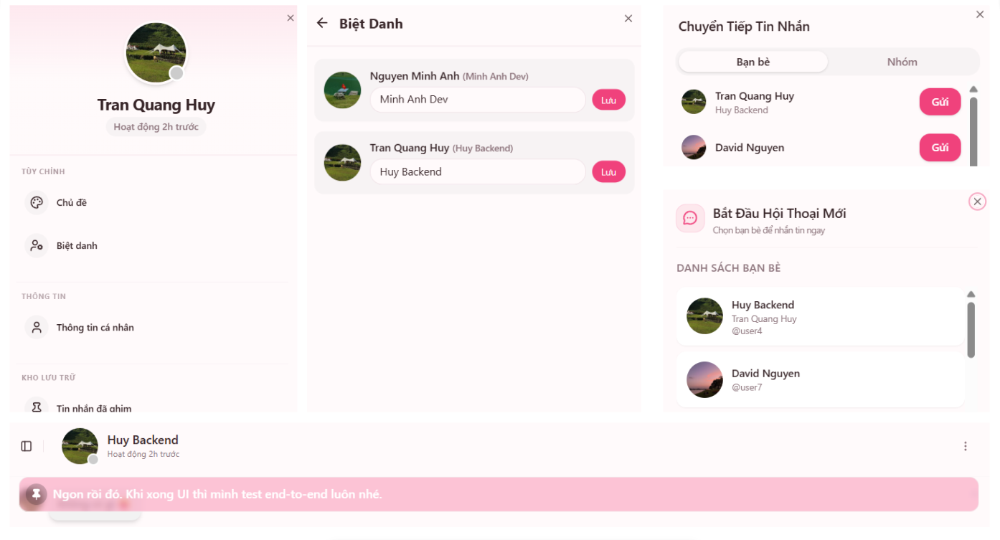

---

### 13. Chat Nhóm

Tạo nhóm chat với nhiều thành viên, hiển thị avatar nhóm (gộp nhiều avatar), danh sách thành viên với phân biệt Quản trị viên (👑). Admin có quyền thêm / xoá thành viên.

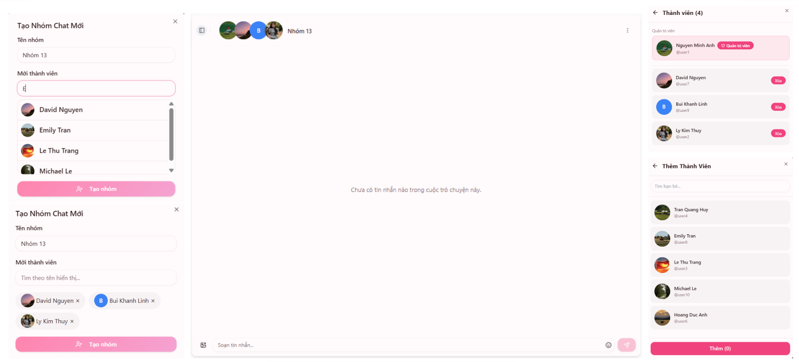

---

### 14. Thêm Bạn & Lời Mời Kết Bạn

- **Tìm & gửi lời mời kết bạn** qua username
- **Quản lý lời mời** đã gửi / đã nhận với 2 tab
- Badge thông báo số lời mời mới trên avatar sidebar

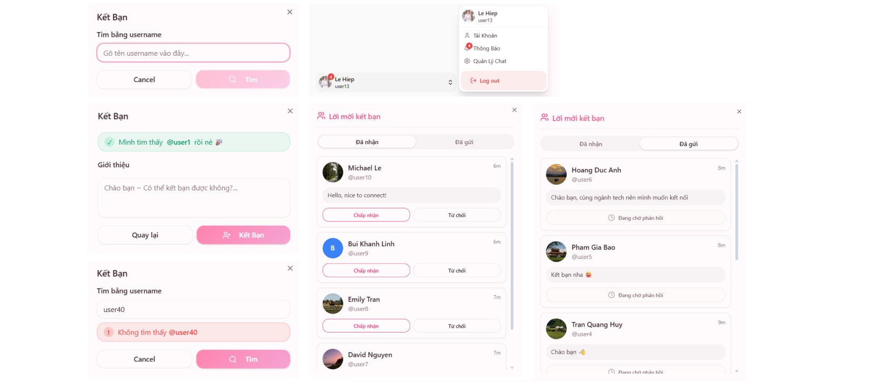

---

### 15. Quản Lý Tài Khoản

Dropdown menu từ avatar sidebar: Tài Khoản, Thông Báo, Quản Lý Chat, Đăng Xuất. Chỉnh sửa thông tin cá nhân, upload avatar qua Cloudinary.

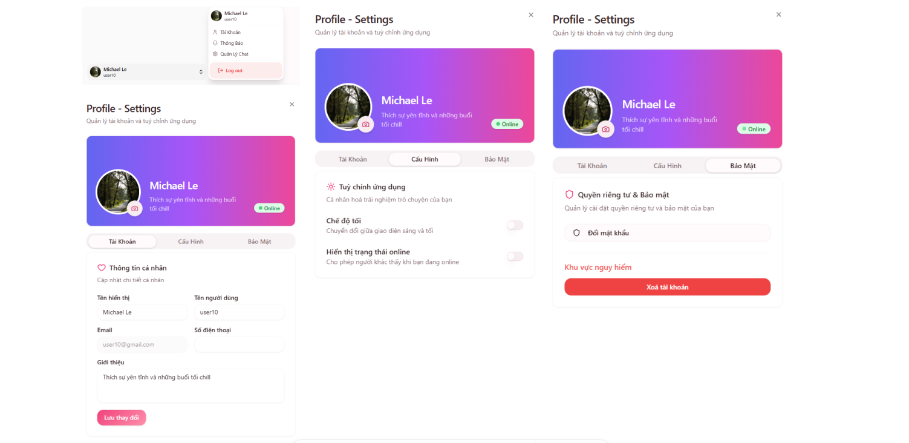

---

### 16. Quản Lý Chat

Cung cấp hệ thống quản lý cuộc trò chuyện toàn diện bao gồm **Ghim tin nhắn**, **Lưu trữ** và **Hạn chế người dùng**. Người dùng có thể xem lại các cuộc trò chuyện đã lưu trữ hoặc bị hạn chế trong các danh sách riêng biệt, kèm theo badge hiển thị số tin nhắn chưa đọc để đảm bảo không bỏ lỡ thông tin quan trọng.

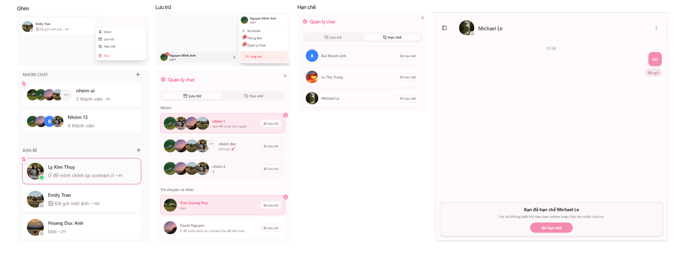

---

### 17. Gửi ảnh - Tìm Kiếm Tin Nhắn

Hỗ trợ **tìm kiếm tin nhắn** trong cuộc trò chuyện, **gửi hình ảnh và xem lại ảnh đã gửi**.

Khi tìm kiếm, hệ thống sẽ hiển thị danh sách tin nhắn khớp với từ khóa. Người dùng có thể click vào kết quả để tự động cuộn đến vị trí tin nhắn trong cuộc trò chuyện, kèm hiệu ứng highlight để dễ nhận biết.

Ngoài ra, người dùng có thể gửi hình ảnh trong chat và xem lại các hình ảnh đã gửi trước đó trong hội thoại.

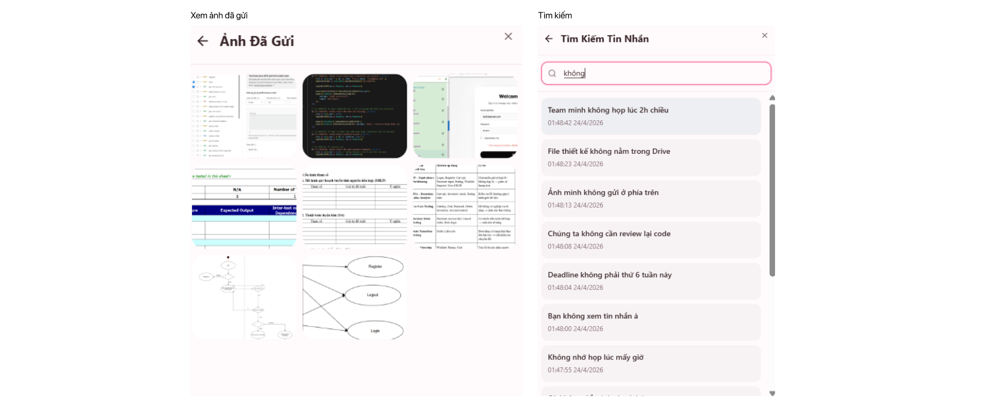

---

## Cấu Trúc Dự Án

```
ChitChat/
├── 📂 fe/                          # Frontend (React + Vite + TypeScript)
│   ├── 📂 src/
│   │   ├── 📂 components/
│   │   │   ├── 📂 auth/            # SignIn, SignUp, ProtectedRoute
│   │   │   ├── 📂 chat/            # ChatWindow, MessageItem, MessageInput, ...
│   │   │   ├── 📂 sidebar/         # AppSidebar, NavUser, NavMain
│   │   │   ├── 📂 profile/         # ProfileDialog, AvatarUploader, ...
│   │   │   ├── 📂 friendRequest/   # FriendRequestDialog, ReceivedRequests
│   │   │   ├── 📂 addFriendModal/  # SearchForm, SendFriendRequestForm
│   │   │   ├── 📂 newGroupChat/    # InviteSuggestionList, SelectedUsersList
│   │   │   ├── 📂 createNewChat/   # FriendListModal
│   │   │   ├── 📂 manageChat/      # ArchivedChatList, RestrictedChatList
│   │   │   ├── 📂 skeleton/        # Loading skeletons
│   │   │   └── 📂 ui/              # Radix UI components (Button, Card, ...)
│   │   ├── 📂 pages/               # SignInPage, SignUpPage, ChatAppPage
│   │   ├── 📂 stores/              # Zustand stores (Auth, Chat, Socket, ...)
│   │   ├── 📂 services/            # API service layers (Axios)
│   │   ├── 📂 hooks/               # Custom React hooks
│   │   ├── 📂 types/               # TypeScript type definitions
│   │   ├── 📄 chatThemes.ts        # 12+ theme configurations
│   │   └── 📄 App.tsx              # Root component + routing
│   └── 📄 package.json
│
├── 📂 be/                          # Backend (Express + MongoDB)
│   ├── 📂 postman/                 # Chứa Postman collection & API testing files
│   ├── 📂 src/
│   │   ├── 📂 controllers/         # Auth, User, Friend, Message, Conversation
│   │   ├── 📂 models/              # User, Message, Conversation, Friend, ...
│   │   ├── 📂 routes/              # RESTful API routes
│   │   ├── 📂 middlewares/         # Auth, Upload, Socket middlewares
│   │   ├── 📂 socket/              # Socket.IO server setup
│   │   ├── 📂 libs/                # Database connection
│   │   ├── 📄 server.js            # Entry point
│   │   └── 📄 swagger.json         # API documentation
│   └── 📄 package.json
│
├── 📂 screenshots/                 # Ảnh chụp giao diện
└── 📄 README.md
```

---

## 🚀 Cài Đặt & Chạy

### Yêu Cầu

- **Node.js** >= 18
- **MongoDB** (local hoặc MongoDB Atlas)
- **Cloudinary** account (để upload ảnh)

### 1. Clone Repository

```bash
git clone https://github.com/your-username/ChitChat.git
cd ChitChat
```

### 2. Cài Đặt Backend

```bash
cd be
npm install
```

Tạo file `.env` trong thư mục `be/`:

```env
PORT=8080
MONGODB_URI=mongodb://localhost:27017/chitchat
JWT_SECRET=your_jwt_secret
JWT_REFRESH_SECRET=your_jwt_refresh_secret
CLIENT_URL=http://localhost:5173
CLOUDINARY_CLOUD_NAME=your_cloud_name
CLOUDINARY_API_KEY=your_api_key
CLOUDINARY_API_SECRET=your_api_secret
```

### 3. Cài Đặt Frontend

```bash
cd fe
npm install
```

Tạo file `.env.development` trong thư mục `fe/`:

```env
VITE_API_URL=http://localhost:8080
```

### 4. Chạy Ứng Dụng

```bash
# Terminal 1 – Backend
cd be
npm run dev

# Terminal 2 – Frontend
cd fe
npm run dev
```

Truy cập: **http://localhost:5173**

API Docs / Postman:
- **Swagger UI:** http://localhost:8080/api-docs
- **Postman Collection:** Mở file `be/postman/ChitChatApp.postman_collection.json`  
  hoặc truy cập:  
  https://www.postman.com/restless-capsule-236537/workspace/lkt/collection/37851469-cbe8a145-a393-498e-837a-023400b0e943?action=share&source=copy-link&creator=37851469
    
---

## 🔌 API Endpoints

### Public

| Method | Endpoint | Mô tả |
|--------|----------|-------|
| POST | `/api/auth/register` | Đăng ký tài khoản |
| POST | `/api/auth/login` | Đăng nhập |
| POST | `/api/auth/refresh` | Làm mới access token |

### Private (Yêu cầu JWT)

| Method | Endpoint | Mô tả |
|--------|----------|-------|
| GET | `/api/users/me` | Lấy thông tin user hiện tại |
| PUT | `/api/users/profile` | Cập nhật profile |
| GET | `/api/friends` | Danh sách bạn bè |
| POST | `/api/friends/request` | Gửi lời mời kết bạn |
| GET | `/api/conversations` | Danh sách cuộc hội thoại |
| POST | `/api/conversations/group` | Tạo nhóm chat |
| GET | `/api/messages/:conversationId` | Lấy tin nhắn |
| POST | `/api/messages/send` | Gửi tin nhắn |
| POST | `/api/messages/image` | Gửi ảnh |

> 📄 Xem đầy đủ tại **Swagger UI**: `http://localhost:8080/api-docs`

---

## 🔌 Socket.IO Events

| Event | Hướng | Mô tả |
|-------|-------|-------|
| `online-users` | Server → Client | Danh sách user đang online |
| `new-message` | Server → Client | Tin nhắn mới |
| `user-typing` | Client ↔ Server | Người dùng đang nhập |
| `user-stop-typing` | Client ↔ Server | Dừng nhập |
| `join-conversation` | Client → Server | Tham gia room chat |
| `leave-conversation` | Client → Server | Rời room chat |
| `user-offline-status` | Server → Client | Trạng thái offline + thời gian |

---

## 👨‍💻 Tác Giả

Được phát triển bởi **KIM THUY** ❤️